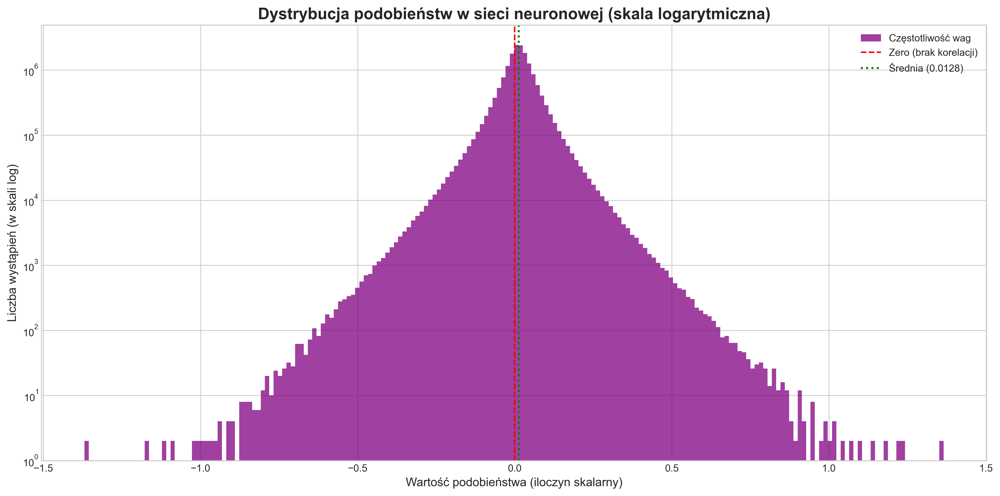

# Projekt "Mini-Smoczątko": wizualizacja narodzin struktury w AI


Ten projekt to praktyczny eksperyment naukowy, który pozwala **zajrzeć do "mózgu" sztucznej inteligencji i zobaczyć na własne oczy zjawisko emergencji**. Implementujemy tu architekturę AI inspirowaną hipotetycznym artykułem "The Dragon Hatchling", trenujemy ją od zera, a na końcu wizualizujemy, jak z chaosu losowych wag rodzi się złożona, nielosowa struktura połączeń neuronowych.

## Kluczowa idea: emergencja

Wyobraź sobie mrowisko. Żadna pojedyncza mrówka nie zna planu budowy. Każda podąża za prostymi zasadami. Jednak z tych prostych, lokalnych interakcji tysięcy mrówek **emerguje** (wyłania się) złożone, inteligentne zachowanie całej kolonii.

W tym projekcie udowadniamy, że to samo dzieje się wewnątrz AI. Zamiast programować "inteligencję", tworzymy proste zasady, a model w trakcie treningu **sam organizuje swoje neurony** w niezwykle złożoną i efektywną strukturę.

## Przykładowe wyniki

Po pełnym cyklu treningu i analizy, otrzymaliśmy dwa fascynujące rezultaty, które możesz odtworzyć samodzielnie.

### 1. Wygenerowany tekst (pierwsze słowa "niemowlęcia")

Model, trenowany od zera na "Panu Tadeuszu", nauczył się podstaw języka polskiego. Choć nie rozumie jeszcze sensu, opanował strukturę słów, pisownię i styl oryginału. To lingwistyczne "niemowlę" na wczesnym etapie nauki.


### 2. Wizualizacja "mózgu" AI (dowód emergencji)

Najważniejszy wynik. Histogram pokazuje rozkład siły połączeń między neuronami modelu. To jest wizualny dowód na narodziny struktury z chaosu!



**Jak to czytać?**
-   **Wysoki szczyt w zerze:** Większość z milionów możliwych połączeń między neuronami jest bardzo słaba. Oznacza to, że sieć jest **rzadka i wydajna**, nie marnuje energii na niepotrzebne połączenia.
-   **"Ciężkie ogony" (heavy tails):** Zauważ, że wartości daleko od zera (zwłaszcza po prawej) występują znacznie częściej, niż powinny w losowym szumie. To są te nieliczne, ale **niezwykle silne połączenia**, które model sam wytworzył w trakcie nauki.

## Jak uruchomić eksperyment?

Możesz odtworzyć cały eksperyment na własnym komputerze, używając `uv` - nowoczesnego i szybkiego menedżera pakietów dla Pythona. (Zalecana karta graficzna NVIDIA).

**1. Sklonuj repozytorium:**
```bash
git clone https://github.com/takzen/Projekt-Mini-Smoczatko.git
cd Projekt-Mini-Smoczatko
```

**2. Zainstaluj `uv` (jeśli jeszcze go nie masz):**
```bash
pip install uv
```

**3. Stwórz środowisko i zainstaluj zależności za pomocą `uv`:**
```bash
# Stwórz środowisko wirtualne w folderze .venv
uv venv

# Aktywuj środowisko
# Windows: .\.venv\Scripts\activate
# MacOS/Linux: source .venv/bin/activate

# Zainstaluj wszystkie pakiety z pliku requirements.txt
uv pip install -r requirements.txt
```

**4. Uruchom trening:**
Skrypt automatycznie pobierze dane ("Pan Tadeusz") i rozpocznie trening.
```bash
python mini_smoczatko.py
```
Po zakończeniu, w folderze pojawi się plik `mini_smoczatko.pth`.

**5. Wygeneruj wyniki:**
```bash
python generuj_tekst.py
python wizualizuj_siec.py
```
Po uruchomieniu tych skryptów otrzymasz plik tekstowy oraz obraz z wizualizacją.

## Licencja
Ten projekt jest udostępniony na licencji MIT. Zachęcam do forkowania, modyfikowania i rozwijania!